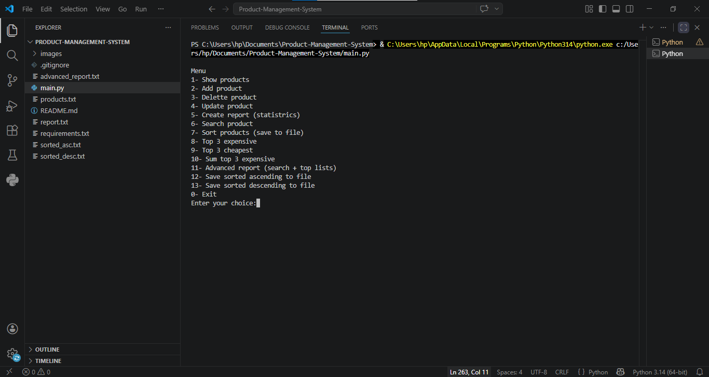
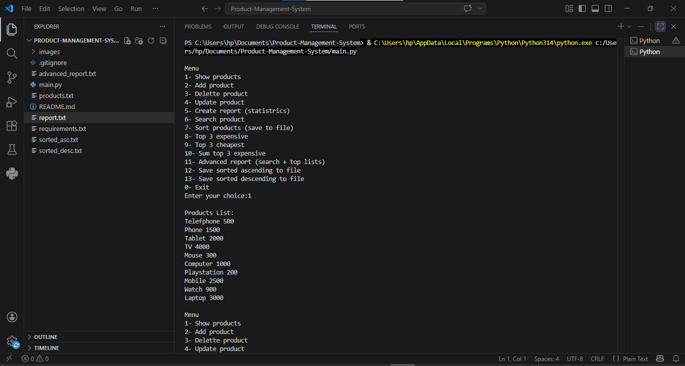
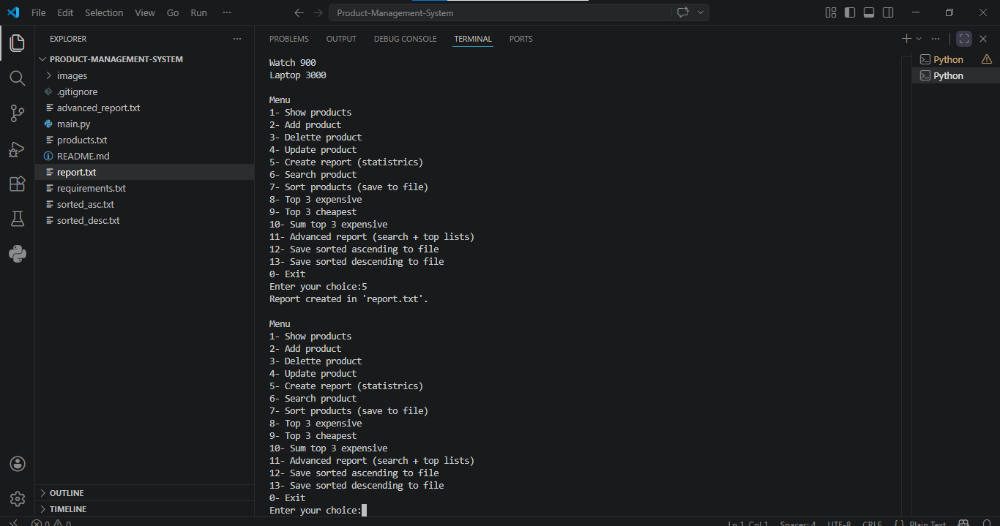
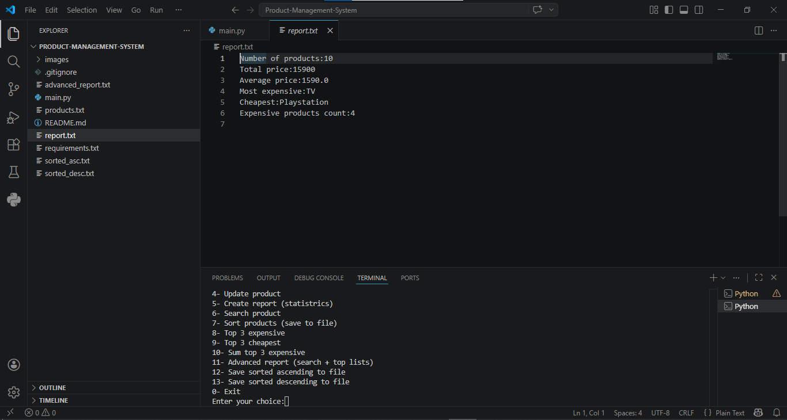

# 📦 Product Management System

A powerful, menu-driven Python application for managing product inventories. This console-based tool allows full CRUD operations, statistical reporting, and advanced file-based sorting.

## ✨ Features (13 Powerful Options)
- *Show Products*: Display all items with their prices.
- *Add Product*: Insert a new item into the inventory.
- *Delete Product*: Remove an item by name.
- *Update Product*: Change the price of an existing item.
- *Create Report*: Generate report.txt with Total, Average, Max, Min, and count of expensive products (>1800).
- *Search Product*: Find a specific item by name.
- *Sort Products*: Permanently sort the main products.txt file from cheapest to most expensive.
- *Top 3 Expensive*: Display the 3 highest-priced items.
- *Top 3 Cheapest*: Display the 3 lowest-priced items.
- *Sum of Top 3*: Calculate the total value of the 3 most expensive items.
- *Advanced Report*: Create advanced_report.txt containing search results + Top 3 expensive + Top 3 cheapest.
- *Save Sorted Ascending*: Export a sorted list (Low→High) to sorted_asc.txt without altering the original file.
- *Save Sorted Descending*: Export a sorted list (High→Low) to sorted_desc.txt without altering the original file.

## 🛠️ Technical Skills Demonstrated
- *File I/O*: Reading and writing multiple .txt files (products.txt, report.txt, advanced_report.txt, etc.).
- *Error Handling*: Robust try/except for missing files and invalid price inputs.
- *Data Structures*: Using Lists and Tuples to manage data efficiently.
- *Functional Logic*: Lambda functions for sorting, loops, and conditionals.
- *Code Organization*: Cleanly structured with if __name__ == "__main__" guard.

# 📸 Screenshots

### Main Menu

### Show Products

### Create Report

### Report Content

## 🚀 How to Run

1. Ensure you have Python installed (version 3.x).
2. Clone the repository or download the files.
3. Save this code as main.py in a folder.
4. Open your terminal/command prompt and run:
   
   python main.py

5. Follow the interactive menu to manage your products.

---

📁 Project Structure

Product-Management-System/
├── main.py                 # Main script
├── products.txt            # Data file (auto-generated)
├── report.txt              # Statistical report
├── advanced_report.txt     # Search + Top lists
├── sorted_asc.txt          # Sorted ascending export
├── sorted_desc.txt         # Sorted descending export
├── requirements.txt        # Dependencies
├── .gitignore              # Ignored files
└── README.md               # Documentation

---

📤 Output Files (Generated by the system)

· products.txt – Main database
· report.txt – Statistical report
· advanced_report.txt – Search + Top lists
· sorted_asc.txt – Sorted ascending export
· sorted_desc.txt – Sorted descending export

---